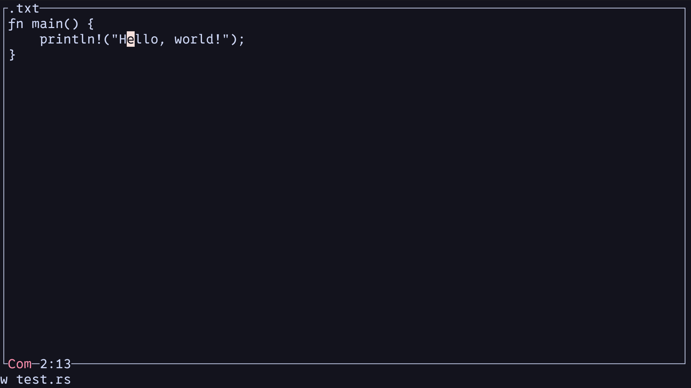
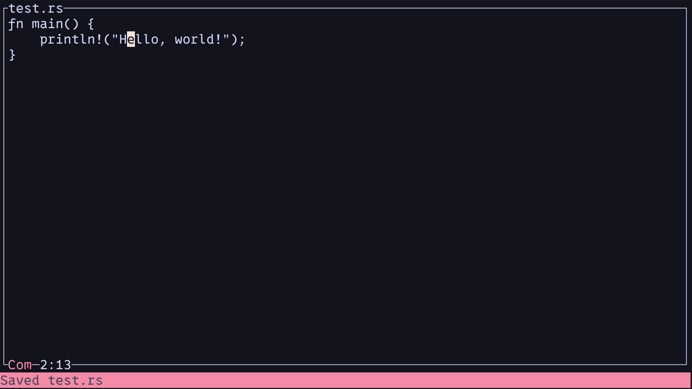

# Heliolisk
A Vim-Like Modal Text Editor with a TUI. Built using Rust.

## Features
- **Modal Editing**:
  - Navigate Mode: Basically Normal Mode
  - Editing Mode: Basically Insert Mode
  - Select Mode: Basically Visual Mode
- **Method Completions**: Context-aware method suggestions.
- **Modern UI**: Frontend implemented in Ratatui.

## Screenshots
### Main Editor Interface

### Saved Notification

---

# Implemented
- Open any file in Heliolisk
- Vim Keybinds
- Rope Data Structure to store text
- Save files
- Modal Editing

# Concepts Learning
- State Representation using Phantom Data
- Representing Data in Structs
- Fully Human-driven Development (to see how far I can push without AI)
- Learning and Implementing new Data Structures

# Contribute
I'm currently looking for people to contribute to this project, so if you are interested, fork your own copy of Heliolisk and create an issue in the project repository.

1. Fork the repo
2. Create a feature branch
3. Commit your changes
4. Push and open a Pull Request

Check out the [Issues](./issues) page for things to work on.

---

