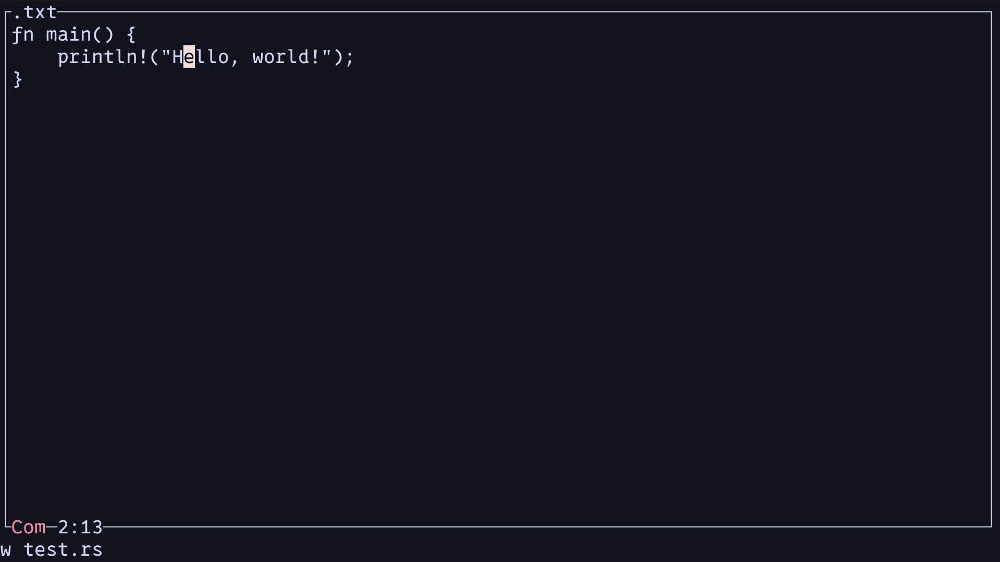
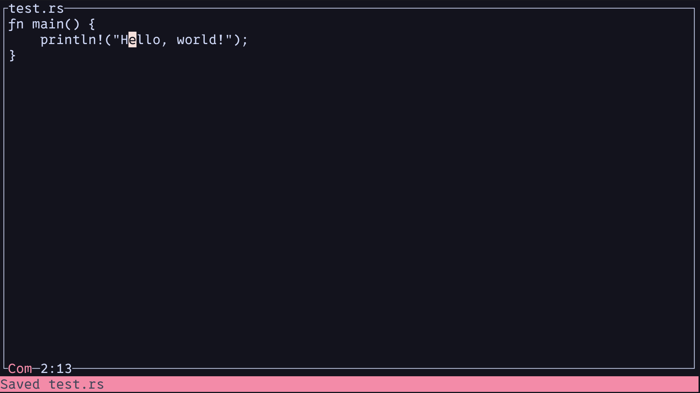
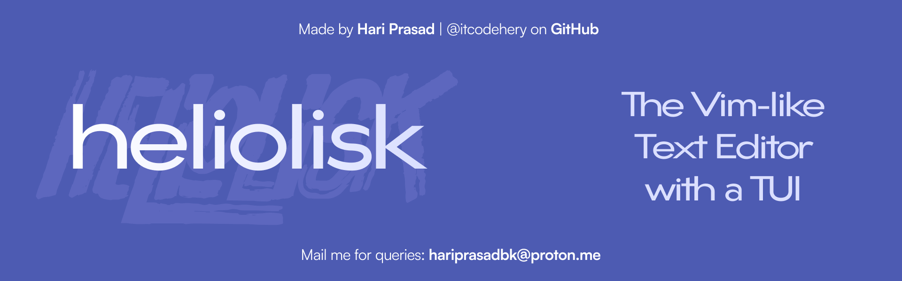

# Heliolisk
A Vim-Like Modal Text Editor with a TUI. Built using Rust and Ratatui.

## Features
- **Modal Editing**:
  - **Navigate Mode**: Fast cursor navigation, word jumps, and command entry (Normal Mode).
  - **Edit Mode**: Standard text typing and editing (Insert Mode).
  - **Select Mode**: Visual text selection and range manipulation (Visual Mode).
  - **Command Mode**: Ex-style colon commands (`:w`, `:wq`, `:q`, `:qa`, `:e`, `:theme`).
- **Built-in File Explorer (`<Space>e`)**:
  - Dual-pane horizontal tree view with lazy directory expansion and collapse.
  - Nerd Font icons for folders and file types (`.rs`, `.toml`, `.md`, `.json`, scripts).
  - Open files directly into editor buffers or collapse directories with `h`/`Enter`.
- **Syntax Highlighting**:
  - Built-in heuristic highlighting with full theme integration.
  - Language support for Rust (`.rs`), TOML (`.toml`), Markdown (`.md`), JSON, and generic text.
- **Hover Documentation (`K`)**:
  - Non-intrusive floating popup at the cursor line.
  - Comprehensive built-in documentation database for language keywords, standard types, and usage signatures.
- **Decoupled LSP Manager (`<Space>l`)**:
  - Modular language server explorer with support for Rust, Python, TypeScript, Go, C/C++, TOML, and JSON.
  - Download and install official language servers into local cache (`~/.local/share/heliolisk/lsp`).
  - Toggle language servers on/off per language; only selected languages provide LSP hover documentation.
- **Custom Color Themes (5 Built-in Presets)**:
  - **Tokyo Night** (Default)
  - **Catppuccin Mocha**
  - **Gruvbox Dark**
  - **Nord**
  - **Solarized Dark**
  - Switch anytime at runtime using `:theme <name>` or `:colorscheme <name>`.
- **Customizable Multi-Chord Keybinding Engine**:
  - Prefix trie router supporting multi-chord leader mappings (e.g. `<Space>e`, `<Space>l`, `dw`, `gg`).
- **Robust Architecture**:
  - Backed by `Ropey` rope data structure for fast large-file operations.
  - Per-buffer cursor memory and viewport scroll offsets.
  - Threaded non-blocking background saving with atomic tmp files.
  - Full Undo/Redo tracking cursor position alongside text history.
  - Unicode character width handling and CRLF line-ending safety.

## Keybindings Reference

| Key / Chord | Mode | Action |
| --- | --- | --- |
| `<Space>e` | Navigate | Toggle File Explorer sidebar |
| `<Space>l` | Navigate | Open LSP Manager / Explorer |
| `K` | Navigate | Show Hover Documentation for word under cursor |
| `i` / `a` | Navigate | Enter Edit mode (before / after cursor) |
| `o` | Navigate | Open new line below and enter Edit mode |
| `v` | Navigate | Enter Select (Visual) mode |
| `Esc` | Edit / Select / Explorer / LSP | Return to Navigate mode or dismiss modals |
| `:` | Navigate | Enter Command mode |
| `h` / `j` / `k` / `l` | Navigate | Move cursor left / down / up / right |
| `w` / `b` / `e` | Navigate | Jump forward word / backward word / word end |
| `^` / `$` | Navigate | Jump to first non-whitespace / end of line |
| `gg` / `G` | Navigate | Jump to top / bottom of file |
| `dw` | Navigate | Delete word to next whitespace |
| `u` / `U` | Navigate | Undo / Redo |
| `Tab` / `Shift-Tab` | Navigate | Switch to next / previous buffer |
| `:w [filename]` | Command | Save buffer asynchronously |
| `:wq [filename]` | Command | Save buffer and quit |
| `:q` / `:qa` | Command | Quit current buffer / Quit all |
| `:theme <name>` | Command | Switch theme (e.g. `:theme tokyo-night`, `:theme catppuccin`) |
| `:e <path>` | Command | Open file into a new buffer |

### File Explorer Controls
- `j` / `k` or `Down` / `Up`: Navigate directory items
- `Enter` or `l`: Open file into buffer / Toggle directory expansion
- `h`: Collapse current directory
- `r`: Refresh directory tree
- `Esc` or `q`: Return focus to editor

### LSP Manager Controls
- `j` / `k` or `Down` / `Up`: Select language server
- `Enter` or `Space`: Toggle LSP enabled / disabled
- `i`: Download & install from official repository
- `u`: Uninstall / remove from cache
- `Esc` or `q`: Close LSP Manager

## Screenshots
### Main Editor Interface

### Saved Notification

---

# Architecture & Design
- **Pluggable & Decoupled LSP Support**: Text editing and language servers are completely decoupled; users selectively enable and download language servers.
- **Rope Data Structure**: Backed by `ropey` for fast insert, delete, and line indexing on large files.
- **Atomic Background I/O**: Asynchronous worker thread writing to temporary files with atomic renames to prevent partial saves or crashes.
- **Nerd Font Glyphs**: Clean terminal aesthetics without emojis.

# Contribute
I'm currently looking for people to contribute to this project, so if you are interested, fork your own copy of Heliolisk and create an issue in the project repository.

1. Fork the repo
2. Create a feature branch
3. Commit your changes
4. Push and open a Pull Request

Check out the [Issues](./issues) page for things to work on.

---

